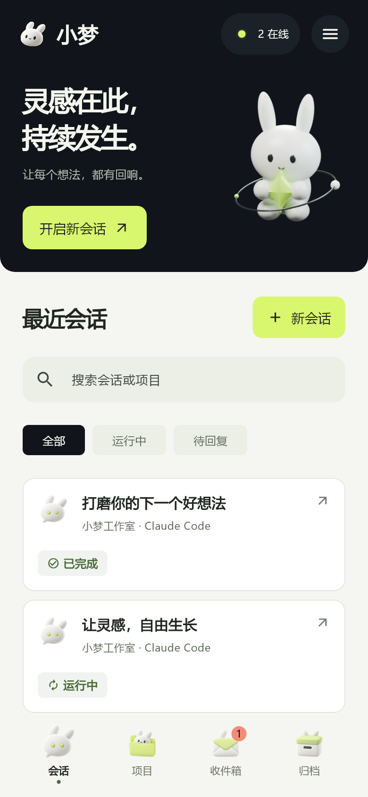
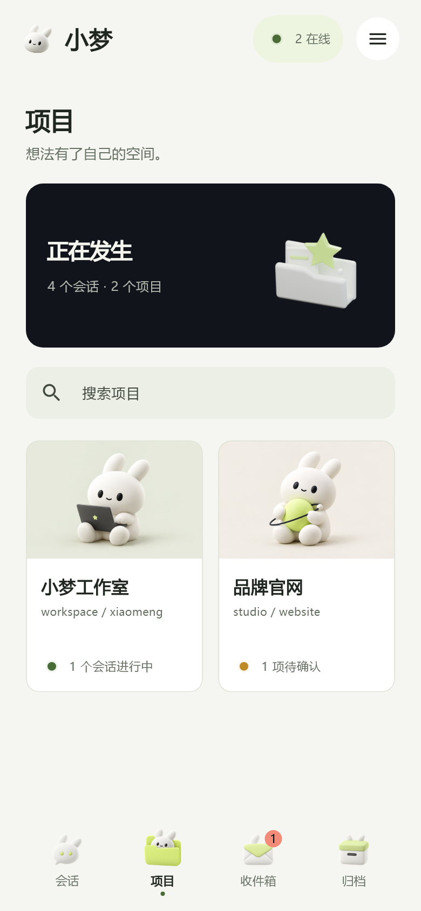
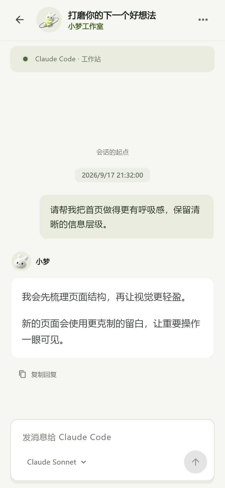
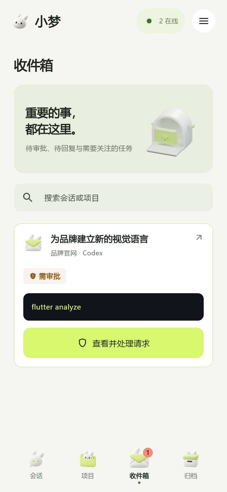
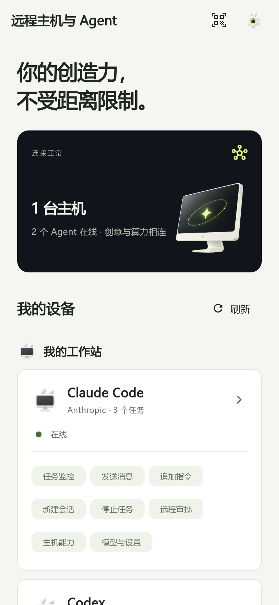
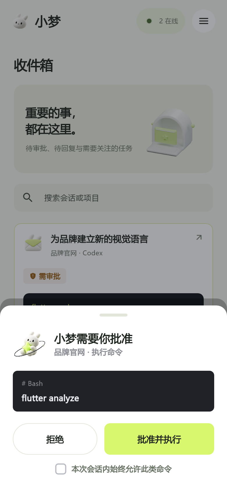
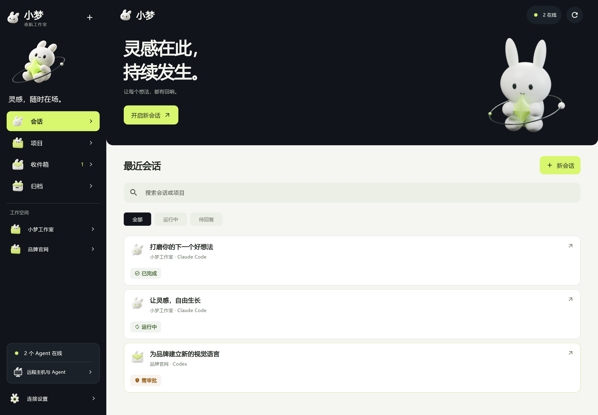

  

<h1 align="center">小梦 · Xiaomeng Hub</h1>

  <strong>让 AI 在电脑上工作，让你在手机上掌握进展。</strong>

  可自托管的 AI Agent 移动控制台，通过局域网连接多台电脑， 
  统一管理 Claude Code、Codex 和自定义 Agent 的项目、会话、实时输出与任务审批。

  <a href="#项目截图">项目截图</a> ·
  <a href="#快速开始">快速开始</a> ·
  <a href="docs/PAIRING.md">扫码绑定</a> ·
  <a href="docs/CODEX_SETUP.md">Codex 接入</a> ·
  <a href="docs/AGENT_PROTOCOL.md">Agent 协议</a>

## 项目介绍

小梦把分散在不同电脑上的 AI 编程任务汇集到一个界面。手机只需连接一个中心服务，就可以查看项目进度、继续对话、处理待审批操作，以及接收任务通知。模型调用与工具执行仍发生在对应的 Agent 主机上。

适合在局域网内管理多台开发电脑，或在离开电脑时，通过手机继续关注和操作 AI 任务。

- **统一工作空间**：按主机、Agent、项目和会话组织任务，支持搜索、状态筛选和归档查看。
- **实时任务进展**：查看流式回复、工具调用、终端输出、文件差异和任务状态。
- **手机继续工作**：按接入端能力新建会话、发送消息、追加指令或停止任务。
- **集中处理待办**：在收件箱查看待审批、待回复事项，操作结果以主机回执为准。
- **扫码绑定主机**：手机获取独立设备凭据，宿主机可查看和解除设备绑定。
- **模型与主机能力**：查看可用模型、推理强度、工作模式，以及接入端提供的技能、MCP 和插件信息。
- **可扩展接入**：提供 HTTP 协议和零第三方依赖的 Node SDK，可接入自定义 Agent。
- **适配多种屏幕**：Flutter 界面支持手机和桌面布局，Android 提供后台连接与本地通知。

具体可用操作取决于 Agent 声明的能力和当前会话的执行通道，详见下方接入能力表。

## 项目截图

以下为项目现有 Flutter 界面的实际组件渲染截图，使用隔离测试数据，采集于 **2026-09-19**。截图中的项目、会话、模型和在线数量为测试示例，实际内容以已接入主机为准。

截图直接引用仓库内的原始 PNG，来源见 [界面截图测试](app/test/ui_v3_review_test.dart) 和 [UI 验证记录](design/ui-v3/refinement/README.md)。

### 手机界面

<table>
  <tr>
    <th width="33%">会话首页</th>
    <th width="33%">项目管理</th>
    <th width="33%">会话详情</th>
  </tr>
  <tr>
    <td></td>
    <td></td>
    <td></td>
  </tr>
  <tr>
    <th>收件箱</th>
    <th>主机与 Agent</th>
    <th>任务审批</th>
  </tr>
  <tr>
    <td></td>
    <td></td>
    <td></td>
  </tr>
</table>

### 桌面布局

更多页面见 [完整界面截图](design/ui-v3/implementation)，包含模型设置、新建会话、归档和窄屏布局。

## 架构与技术栈

~~~mermaid
flowchart LR
  Phone["Flutter 手机 / 桌面界面"] <-->|REST / WebSocket| Hub["小梦中心服务"]
  Local["本机 Claude Code 适配器"] --> Hub
  A["电脑 A：Claude 接入端"] -->|主动连接| Hub
  B["电脑 B：Codex 接入端"] -->|主动连接| Hub
  C["电脑 C：自定义 Agent"] -->|HTTP / Node SDK| Hub
  Hub --> DB[("SQLite")]
~~~

| 部分 | 技术与职责 |
| --- | --- |
| 客户端 | Flutter / Dart、Riverpod；项目、会话、审批与连接管理 |
| 中心服务 | Node.js、Express、ws；认证、状态汇总、事件推送与操作路由 |
| 存储 | Node 内置 `node:sqlite`；保存事件、Agent 身份、审批与设备绑定 |
| Agent 接入 | HTTP、SSE、Node SDK；主动上报数据并领取远程操作 |
| Android 通知 | Kotlin 前台服务与本地通知；维护后台连接 |

项目与会话按 Agent 隔离，同名项目或相同工作路径不会混在一起。中心通过 SSE 通知 Agent 领取命令，轮询作为断线回退；客户端通过 WebSocket 接收实时输出。

### 接入能力

| 接入方式 | 监控 / 历史 | 发送消息 | 停止任务 | 新建会话 | 模型 / 设置 |
| --- | --- | --- | --- | --- | --- |
| 本机 Claude Code | 支持 | 支持 | 平台启动的任务 | 支持 | 下一轮生效 |
| 其他电脑的 Claude 桥接端 | 支持 | 支持 | 该桥接服务启动的任务 | 暂未声明此能力 | 下一轮生效 |
| Codex 桌面 + App Server | 支持 | 续聊、桌面执行中追加 | 当前桌面 / 共享服务任务 | 支持 | 读取主机模型列表，下一轮生效 |
| 通用 HTTP 协议 / Node SDK | 支持 | 按处理器声明 | 按处理器声明 | 按处理器声明 | 统一目录与设置协议 |
| 内置演示 Agent | 支持 | 模拟流式回复 | 支持 | 支持 | 演示模型 |

审批与问题回复同样受接入端能力约束。独立客户端正在执行、但未共享操作通道的任务保持只读；完整说明见 [Codex 接入指南](docs/CODEX_SETUP.md)。

## 快速开始

下面的命令使用 **PowerShell**，从本机 Codex 与手机连接的常用场景开始。

### 1. 准备环境并获取代码

需要：

- **Node.js ≥ 22.5**，后端使用 Node 内置 SQLite。
- **Flutter SDK**，包含满足 `app/pubspec.yaml` 约束的 **Dart 3.12.x 或更高的 3.x 版本**。
- 构建或运行 Android 客户端时，需要 Android SDK 和设备 / 模拟器。
- 使用一体启动接入 Codex 时，主机需已安装并登录 Codex CLI。
- 手机与中心服务所在电脑位于同一可信局域网。

~~~powershell
git clone https://github.com/xh20220630/xiaomeng-hub.git
cd xiaomeng-hub
~~~

### 2. 启动中心服务与本机 Codex

~~~powershell
cd server
npm ci
npm run host
~~~

这个命令同时启动中心服务和本机 Codex 接入端，自动生成并保存主机令牌。配置、数据库和接入身份保存在当前用户目录的 `.xiaomeng/host/` 中；后续启动复用原绑定，Codex 接入进程退出后自动重试。

默认连接管理页为 **http://localhost:4820/pair/**，实际地址以启动日志为准。已有配置会复用保存的端口，同一配置只运行一个实例。

一体启动默认导入本机全部 Codex 项目与会话；需要限定目录时，参照 [Codex 接入指南](docs/CODEX_SETUP.md) 配置 `CODEX_SCOPE=projects` 和 `CODEX_PROJECTS`。一体启动默认关闭本机 Claude 适配器，需要同时接入时，在启动前设置 `$env:LOCAL_CLAUDE = '1'`。

### 3. 运行客户端

在另一个终端中，从仓库根目录执行：

~~~powershell
cd app
flutter pub get
flutter run
~~~

选择已连接的 Android 设备或模拟器。查看浏览器布局可运行 `flutter run -d chrome`；扫码相机、后台连接和通知能力以对应平台实际支持为准。

需要自行生成 Android 安装包时：

~~~powershell
flutter build apk --release
~~~

输出位于 `app/build/app/outputs/flutter-apk/app-release.apk`。当前 Android 工程的 release 配置使用开发调试签名，正式分发前需配置自己的签名。

### 4. 扫码绑定

1. 在宿主机浏览器打开启动日志中的 `/pair/` 页面。
2. 选择手机能够访问的局域网地址，确认页面显示 Agent 在线。
3. 在 App 的「连接设置」或「主机与连接」页面选择「扫码绑定宿主机」。
4. 扫码后核对主机名称与地址，确认绑定。

相机不可用时，可在扫码页粘贴绑定链接。也可以在连接设置中手动填写中心服务的 IP、端口与 `AUTH_TOKEN`。

每台设备使用独立令牌，宿主机管理页可解除设备绑定。绑定成功只表示手机已连接中心服务，任务列表还需要对应 Agent 在线并完成同步。完整说明见 [扫码绑定文档](docs/PAIRING.md)。

## 其他部署方式

### 只启动中心服务

适合由其他电脑主动连接 Agent，或先使用演示 Agent 体验界面。在仓库根目录进入服务端：

~~~powershell
cd server
npm ci
$env:AUTH_TOKEN = '替换为至少32字符的随机令牌'
$env:LOCAL_CLAUDE = '0'
npm start
~~~

服务默认监听 `0.0.0.0:4820`。需要读取中心电脑上的 Claude Code 数据时，将 `LOCAL_CLAUDE` 改为 `1`。

### 连接演示 Agent

在另一个终端的 `server` 目录运行：

~~~powershell
$env:HUB_URL = 'http://中心电脑的局域网IP:4820'
$env:HUB_TOKEN = '中心服务的注册令牌'
$env:NODE_ID = 'demo-workstation'
npm run agent:demo
~~~

演示 Agent 不调用模型、不执行系统命令。发送消息可以体验流式回复，消息包含 `/approve` 时可体验审批流程，回复过程中可停止任务。

### 连接其他电脑上的 Codex

在 Codex 所在电脑获取本仓库、安装服务端依赖，并确认 Codex CLI 已登录后，在 `server` 目录运行：

~~~powershell
$env:HUB_URL = 'http://中心电脑的局域网IP:4820'
$env:HUB_TOKEN = '中心服务的注册令牌'
$env:NODE_ID = 'codex-workstation'
$env:CODEX_SCOPE = 'host'
$env:CODEX_PROJECTS = '["D:\\work\\my-project"]'
npm run agent:codex
~~~

`CODEX_SCOPE=host` 导入该主机全部 Codex 项目与会话，包括归档；会话正文按需分页。此模式下 `CODEX_PROJECTS` 仅提供初始项目目录，不限制导入范围。

桌面当前任务、共享 App Server 和按目录接入的配置见 [Codex 接入指南](docs/CODEX_SETUP.md)。

### 连接其他电脑上的 Claude Code

在 Claude 所在电脑运行本项目服务端作为本机桥接服务，设置稳定的 `AUTH_TOKEN`，保留 `LOCAL_CLAUDE=1`，并将 Claude Code hooks 指向该桥接服务。可用启动命令见 [服务端说明](server/README.md)。

然后在该电脑另一个终端的 `server` 目录运行：

~~~powershell
$env:HUB_URL = 'http://中心电脑的局域网IP:4820'
$env:HUB_TOKEN = '中心服务的注册令牌'
$env:BRIDGE_URL = 'http://127.0.0.1:4820'
$env:BRIDGE_TOKEN = '本机桥接服务的AUTH_TOKEN'
$env:NODE_ID = 'claude-workstation'
npm run agent:connect
~~~

中心服务与本机桥接服务是两个服务；同机部署时使用不同端口。现有 Claude gate 对 `D:cc_project` 下的项目保留忽略规则，这些项目的工具审批仍走 Claude 本地流程，远程监控与续聊不受影响。

### 接入自定义 Agent

使用 [Node SDK](server/sdk/agent-client.mjs) 和 [可运行的演示接入端](server/scripts/demo-agent.mjs)，也可以使用 Python、Go 等语言直接实现 HTTP 协议。

接入端通过 `message.send`、`message.steer`、`session.start`、`session.stop`、`approval.respond` 等处理器声明能力；只提供监控时，可以仅上报项目、会话和事件。

身份、事件格式、命令回执与审批超时语义见 [Agent 接入协议](docs/AGENT_PROTOCOL.md)。SDK 凭据默认保存在用户目录 `.xiaomeng/agents/`，重连时需要保留。

## 配置参考

| 环境变量 | 默认值 | 用途 |
| --- | --- | --- |
| `HOST` / `PORT` | `0.0.0.0` / `4820` | 中心服务或桥接服务监听地址 |
| `AUTH_TOKEN` | 手动启动时为空 | App / API 认证；远程 Agent 和扫码绑定需要配置 |
| `AGENT_TOKEN` | 使用 `AUTH_TOKEN` | 可单独设置 Agent 注册令牌 |
| `LOCAL_CLAUDE` | `npm start` 为 `1`，`npm run host` 为 `0` | 是否启用本机 Claude 适配器与 hooks |
| `LOCAL_CODEX` | 一体启动时开启 | 设为 `0` 可禁用一体启动的本机 Codex 接入 |
| `XIAOMENG_HOST_CONFIG` | 用户目录 `.xiaomeng/host/config.json` | 一体启动配置文件位置 |
| `DB_PATH` | 手动启动为 `server/data.db` | SQLite 数据库；一体启动默认使用配置目录 |
| `CLAUDE_PROJECTS_DIR` | 用户目录 `.claude/projects` | 本机 Claude 会话来源 |
| `HUB_URL` / `HUB_TOKEN` | 接入端手动设置 | 中心地址与 Agent 注册令牌 |
| `NODE_ID` / `NODE_NAME` | 按接入端配置 | 稳定主机标识与显示名称 |
| `AGENT_STATE_FILE` | 用户目录 `.xiaomeng/agents/` 下 | 自定义 SDK 身份文件路径 |
| `AGENT_OFFLINE_MS` | `45000` | Agent 心跳过期时间 |
| `AGENT_COMMAND_TIMEOUT_MS` | `60000` | 远程操作回执期限 |

一体启动优先读取已保存配置，并允许对应环境变量覆盖。Codex 专用变量见 [Codex 配置表](docs/CODEX_SETUP.md#配置)。

## 项目结构

~~~text
xiaomeng-hub/
├── app/                         Flutter 客户端与平台工程
│   ├── lib/screens/             会话、项目、Agent、设置等页面
│   ├── lib/state/               实时状态、历史记录与连接配置
│   ├── lib/services/            REST、WebSocket、通知与配对
│   ├── assets/                  小梦形象、界面素材与动画图集
│   └── test/                    交互、协议与界面截图测试
├── server/
│   ├── src/                     中心服务、认证、审批与操作路由
│   ├── sdk/                     通用 Agent SDK 与 Codex 适配
│   ├── scripts/                 一体启动、接入端与演示脚本
│   ├── public/pair/             宿主机扫码绑定管理页
│   └── test/                    服务端协议与集成测试
├── docs/                        接入协议、部署与设计文档
├── design/ui-v3/implementation/  实际 Flutter 界面截图
├── scripts/design/              素材与动画制作脚本
└── 资源/                        原型与历史需求资料
~~~

安装包、数据库、日志、依赖目录和构建缓存由 Git 忽略；应用运行所需素材和 README 引用的截图保留在仓库内。

## 开发与验证

后端测试使用临时数据库与模拟 Agent，不启动真实模型任务。从仓库根目录按需运行：

~~~powershell
cd server
npm test
cd ../app
flutter analyze
flutter test
~~~

重新采集 Flutter 界面截图：

~~~powershell
cd app
flutter test test/ui_v3_review_test.dart --dart-define=STATIC_CAPTURE=true --dart-define=UI_REVIEW_DIR=../design/ui-v3/implementation
~~~

该命令使用隔离测试数据和静态动画模式，输出到现有截图目录。真实设备扫码、后台存活与跨机器网络条件需要单独验证。

## 当前边界

- **网络**：当前手机与中心服务使用 HTTP / WebSocket，适用于可信局域网；未提供公网中继、自动穿透或移动端 HTTPS 连接配置。
- **客户端平台**：Android 已有构建与前台服务实现；iOS Live Activity 仍是脚手架，需要 macOS / Xcode 和真机验证，目前没有 FCM / APNs。
- **Codex 兼容性**：桌面适配依赖内部版本化 IPC，已验证 Windows Codex `26.903.8094.0`；桌面升级后需要回归检查，macOS / Linux 桌面端点尚未实机验证。
- **数据范围**：同步本地主机上的 Agent 数据，不包含普通 ChatGPT 云端聊天，也不会自动扫描局域网内任意进程。
- **离线与历史**：离线保留项目和会话索引；Codex 完整正文需要主机在线。流式片段不持久化，接入端需上报最终回复以保存历史。
- **操作权限**：发送、停止、新建和审批按任务实际能力启用；断线、超时或停止不会自动批准操作。

## 文档导航

- [扫码绑定与设备管理](docs/PAIRING.md)
- [Codex 接入与远程任务操作](docs/CODEX_SETUP.md)
- [通用 Agent 接入协议](docs/AGENT_PROTOCOL.md)
- [服务端启动与脚本说明](server/README.md)
- [UI 实现与设计说明](docs/UI_REDESIGN.md)
- [界面精修与截图验证记录](design/ui-v3/refinement/README.md)

`BUILD_SPEC_V2.md` 与早期通知文档保留历史设计参考；当前平台行为以本 README、接入协议和实际代码为准。
